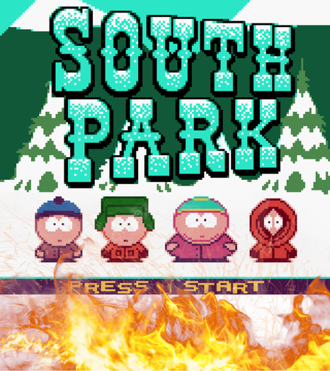

# lab-game-project

# ON FIRE



> **Arcade-style survival game:** dodge deadly fireballs from erupting volcanoes, munch on Kenny clones to grow stronger, and see how long you can stay **on fire** without getting burned.

---

## Description

You pilot **Mecha**, a hungry iron beast trapped inside an active volcanic field.  
Volcanoes constantly spew fireballs upward; three hits and it’s game over.  
Meanwhile, clueless Kennys wander the arena—eat them to grow in size _and_ rack up points, but beware: a bigger Mecha is easier to hit!

---

## Main Functionalities

- **Start / Game / Game-Over Screens** with smooth audio transitions.
- **Keyboard Controls**
  - <kbd>Space</kbd> / <kbd>↑</kbd> Jump up
  - <kbd>↓</kbd> Move down
  - <kbd>→</kbd> Move right
  - <kbd>←</kbd> Move left
- **Dynamic Volcano System**
  - Five volcanoes throw fireballs at different rhythms.
  - Fireballs travel vertically and cause damage on impact.
- **Life & Score HUD**
  - Three heart icons = three lives.
  - Real-time counter shows Kennys eaten.
- **Growing Mechanic** – each Kenny eaten enlarges Mecha, increasing both reach _and_ risk.
- **Sound FX & Music Loops** for actions, damage, kills, and end screen.

---

## Backlog / Future Ideas

- Difficulty scaling over time (faster fireballs, more volcanoes).
- Power-ups (temporary shield, slow-motion, double score).
- Mobile / touch controls.
- High-score persistence (Local Storage).
- Animated backgrounds and particle effects.
- Menu settings for audio volume and key remapping.

---

## Technologies Used

- **HTML5** – semantic structure & game states
- **CSS3** – responsive layout & background art
- **JavaScript (ES6)** – game logic & classes
  - DOM manipulation for real-time rendering
  - `setInterval`, `setTimeout` game loops
  - Native **Audio()** for SFX & music

---

## States / Screens

1. **Start Screen** – logo + “Start!” button
2. **Game Screen** – arena, HUD, active gameplay
3. **Game-Over Screen** – final score & retry prompt

---

## Project Structure

```text
.
├── index.html          # Game markup & state containers
├── styles/
│   └── style.css       # Visual styles
└── js/
    ├── main.js         # Entry point, DOM cache, event listeners,
    │                   # game loop, collision checks, state control
    ├── fireball.js     # class Fireball { speed; automaticMovement() }
    ├── volcano.js      # class Volcano { throwBall() }
    ├── mecha.js        # class Mecha { up(); down(); left(); right(); growing(); }
    ├── kenny.js        # class Kenny { random spawn coords }
    └── heart.js        # class Heart { static life icons }
```

## 📎 Extra Links

| Resource                | Link                                        |
| ----------------------- | ------------------------------------------- |
| **Presentation Slides** | _( URL)_                                    |
| **Live Demo / Deploy**  | https://maeloe.github.io/lab-game-project/) |
